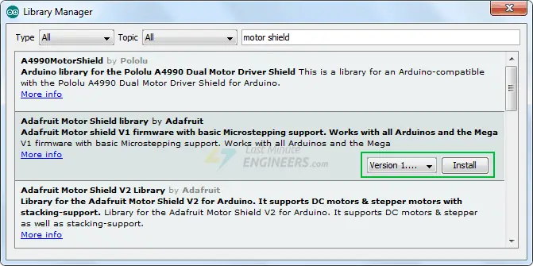

# Arduino IDE Setup

1. Installed adafruit motorshield library (2.x)

 https://lastminuteengineers.com/l293d-motor-driver-shield-arduino-tutorial/

# Wiring

1. Follow wiring from: https://github.com/mahirgul/wifi-nodemcu-robot-esp8266?tab=readme-ov-file

# Running

1. modify wi-fi connectivity details (SSID + pwd) at `sketch_mar22b.ino`:
    ```
    #define STASSID "TODO"
    #define STAPSK  "TODO"
    ```

1. 